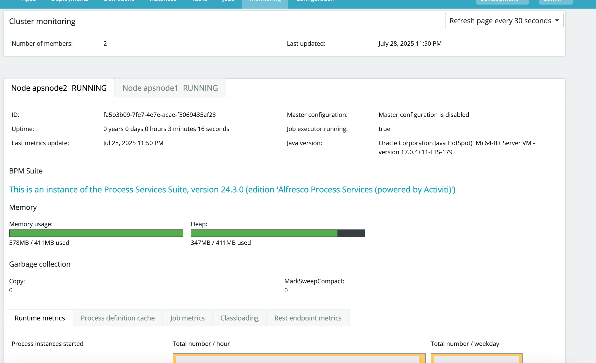

# aps-modo-cluster

info de aps modo cluster instalation

# EN TODOS LOS NODOS SE INSTALA

JDK 17
TOMCAT

### anotation (no lo pongan en el doc)
postgresql-13

# Nodo 1

RRQUISITO
JDK 17
Postgress
elastic search
activit admin
activi nodo1

- se intalar postgrsessq13
- abriendo puerto para que los otros nodos se puedan conectando
- por seguridad no se permite logeo de root desde el exteror
-  1. Editar postgresql.conf para escuchar en IP externas
sudo vi /var/lib/pgsql/13/data/postgresql.conf
Busca la línea:
#listen_addresses = 'localhost'
Y cámbiala a:
listen_addresses = '*'
Esto permite a PostgreSQL escuchar en todas las interfaces de red. Puedes poner una IP específica si prefieres restringir
✅ 2. Editar pg_hba.conf para permitir conexiones remotas
sudo vi /var/lib/pgsql/13/data/pg_hba.conf
Agrega al final algo como esto:
# Permitir a cualquier IP conectarse con autenticación md5 (contraseña)
host    all             all             0.0.0.0/0               md5

✅ 3. Abrir el puerto 5432 en el firewall
sudo firewall-cmd --add-port=5432/tcp --permanent
sudo firewall-cmd --reload

reincia postgresssql13
sudo systemctl restart postgresql-13

-- creamos los users
create role alfresco login password 'alfresco';
create database activiti encoding 'utf8';
grant all on database activiti to alfresco;
create database activitiadmin encoding 'utf8';
grant all on database activitiadmin to alfresco;

habilitamos el firewall

# ] systemctl status firewalld
# ] firewall-cmd --zone=public --add-port=7070/tcp --permanent

# (En el nodo donde se instalará Elasticsearch, ejecutar además:)

# ] firewall-cmd --zone=public --add-port=9200/tcp --permanent
# ] firewall-cmd --reload
# ] firewall-cmd --list-all    (Para verificar puertos abiertos)

# ] adduser alfresco

 Ajuste de límites de archivos abiertos: Editar el archivo /etc/security/limits.conf en cada nodo para aumentar los límites de descriptores de archivos para el usuario alfresco. Añadir al final del archivo las siguientes líneas:

    alfresco    soft    nofile    40000
alfresco    hard    nofile    65536

- Servidor nfs
(nodo 1)
instalar nfs
sudo dnf install -y nfs-utils

Paso 2: Crear el directorio a compartir
sudo mkdir -p /opt/alfresco/alfresco-process-services/compartido
sudo chown -R nobody:nobody /opt/alfresco/alfresco-process-services/compartido
sudo chmod 777 /opt/alfresco/alfresco-process-services/compartido

Ahora agregamos la carpeta compartida a exports
sudo vi /etc/exports

agregas las ips de todos los nodos
remplace {ip-nodo-1) y (ip-nodo-2)
/opt/alfresco/alfresco-process-services/compartido {ip-nodo-1}(rw,sync,no_root_squash) {ip-modo-2}(rw,sync,no_root_squash)

-- eneste caso
/opt/alfresco/alfresco-process-services/compartido 192.168.100.23(rw,sync,no_root_squash) 192.168.100.21(rw,sync,no_root_squash)

[root@apsnode1 ~]# 
sudo systemctl enable --now nfs-server
Created symlink /etc/systemd/system/multi-user.target.wants/nfs-server.service → /usr/lib/systemd/system/nfs-server.service.
[root@apsnode1 ~]# sudo exportfs -r
[root@apsnode1 ~]# sudo exportfs -v

/opt/alfresco/alfresco-process-services/compartido
                192.168.100.23(sync,wdelay,hide,no_subtree_check,sec=sys,rw,secure,no_root_squash,no_all_squash)
/opt/alfresco/alfresco-process-services/compartido
                192.168.100.21(sync,wdelay,hide,no_subtree_check,sec=sys,rw,secure,no_root_squash,no_all_squash)

[root@apsnode1 ~]# sudo firewall-cmd --permanent --add-service=nfs
success
[root@apsnode1 ~]# sudo firewall-cmd --reload
success
[root@apsnode1 ~]# 


Ahora si a instalar
movemos el archvo aps.zip
Creación de carpetas para la instación

Se debe crear la carpeta de alfresco para la instalación

#]
mkdir /opt/alfresco


Damos propiedad al usuario alfresco

#]
chown -R alfresco:alfresco /opt


mkdir /opt/instaladores

// se sigue los pasos igual 
instalcion java
Instalación de Apache Tomcat (lo mismo)
Instalación de Alfresco Process Services versión 24.2 (lo mismo)
SE CAMBIA EN EL MOMENTO DE ACA
vi /opt/alfresco/alfresco-process-services/tomcat/lib/activiti-app.properties

-> haciendo referencia la folde que se comparte
contentstorage.fs.rootFolder=/opt/alfresco/alfresco-process-services/compartido

# Carpeta para almacenamiento de contenido (debe ser la ruta compartida NFS configurada)
contentstorage.fs.rootFolder=/opt/alfresco/alfresco-process-services/act_data/data

# Carpeta para índices ElasticSearch embebidos (no se usará en modo clúster con ES externo)
elastic-search.data.path=/opt/alfresco/alfresco-process-services/act_data/activiti-elastic-search-data

# URL base para notificaciones por email (ajustar si se usa DNS o balanceador)
email.base.url=http://<HOST_NODO>:7070/activiti-app

license.allow-upload=true


y agregamos esto si en caso quires cambair el nombre del clustwr creas otro
cluster.enable=true
cluster.config.adminapp.url=http://192.168.1.85:7070/activiti-admin
cluster.config.name=development
cluster.config.username=dev
cluster.config.password=dev
cluster.config.metricsendinginterval=30

lo mismo con elastgic ahora solo abrimos los puertos de elastic
en el yml de vi /etc/elasticsearch/elasticsearch.yml

transport.host: 0.0.0.0

sudo firewall-cmd --permanent --add-port=9200/tcp

# Recargar reglas
sudo firewall-cmd --reload


# Nodo 2 - 3- etc etc

#### Montaje de NTF
sudo dnf install -y nfs-utils

🟦 Paso 2: Crear el punto de montaje
sudo mkdir -p /opt/alfresco/alfresco-process-services/act_data/data

🟦 Paso 3: Montar el recurso NFS exportado desde Nodo1
sudo mount -t nfs {ip-nodo-1}/opt/alfresco/alfresco-process-services/compartido \
  /opt/alfresco/alfresco-process-services/act_data/data

Verificamos creando na archivo
touch /opt/alfresco/alfresco-process-services/act_data/data/prueba.txt
ls /opt/alfresco/alfresco-process-services/act_data/data

> entra al nodo 1 y debe aparecer los msmo archivos

🟦 Paso 4: Montaje permanente (aun por verde )
vi /etc/fstab

{ip-nodo-1}:/opt/alfresco/alfresco-process-services/compartido  /opt/alfresco/alfresco-process-services/act_data/data  nfs  defaults  0 0
-- en este caso
192.168.100.23:/opt/alfresco/alfresco-process-services/compartido  /opt/alfresco/alfresco-process-services/act_data/data  nfs  defaults  0 0

y ejecuta 
systemctl daemon-reload
sudo mount -a

Ahora instalacon de aps normal sin al actibi admin

instaldos el jdk normal

lo mimso con aps copianos el activiti-app.propeties del nodo 1 al nodo 2
perooo en localhost pon la ip de tu db 
datasource.driver=org.postgresql.Driver
datasource.url=jdbc:postgresql://192.168.1.85/activiti?characterEncoding=UTF-8
datasource.username=alfresco
datasource.password=alfresco

y 
contentstorage.fs.rootFolder=/opt/alfresco/alfresco-process-services/act_data/data

elastic-search.rest-client.address=192.168.1.85

// recuerda por cada nodo cambia el use y pass
cluster.enable=true
cluster.config.adminapp.url=http://<IP-O-HOST-DEL-ADMIN>:7070/activiti-admin
cluster.config.name=dev (el nombre que cluster)
cluster.config.username=dev (user)
cluster.config.password=dev (pwd)
cluster.config.metricsendinginterval=30

e ese caso
cluster.enable=true
cluster.config.adminapp.url=http://192.168.1.85:7070/activiti-admin
cluster.config.name=development
cluster.config.username=dev
cluster.config.password=dev
cluster.config.metricsendinginterval=30


iniciamos el aps 
(re pepite lo mismo en los demas nodos)

## vwrificamos la conexion de los nodos ingresamos al panel de adin 

http://192.168.1.85:7070/activiti-admin/#/engine



en monitorin debe salir los nodso instalados.

con eso finalizamos la instacacion,

ahora pasamosp por la capa de loadbalancer

EL LOAD PUEDE SER EN EL NODO1 O EN OTRO SERVIDOR APARTE EN ESTE CASO NOD 

- habiltioado el sel linux
innstalko ngnix
sudo dnf install nginx -y
sudo setsebool -P httpd_can_network_connect 1
sudo vi /etc/nginx/conf.d/aps-balancer.conf
```
upstream aps_cluster {
    server 192.168.1.85:7070;
    server 192.168.1.86:7070;
}

server {
    listen 80;

    location /activiti-app/ {
        proxy_pass http://aps_cluster/activiti-app/;
        proxy_http_version 1.1;
        proxy_set_header Host $host;
        proxy_set_header X-Real-IP $remote_addr;
        proxy_set_header X-Forwarded-For $proxy_add_x_forwarded_for;
        proxy_set_header X-Forwarded-Proto $scheme;
    }
}
```
verificmao erroes 
sudo nginx -t
sudo systemctl start nginx

sudo firewall-cmd --add-port=80/tcp --permanent
abrimos el peuro 80 
sudo firewall-cmd --reload

verificamos 

 la ip debe ser tu loadbalcner
http://192.168.1.85/activiti-app